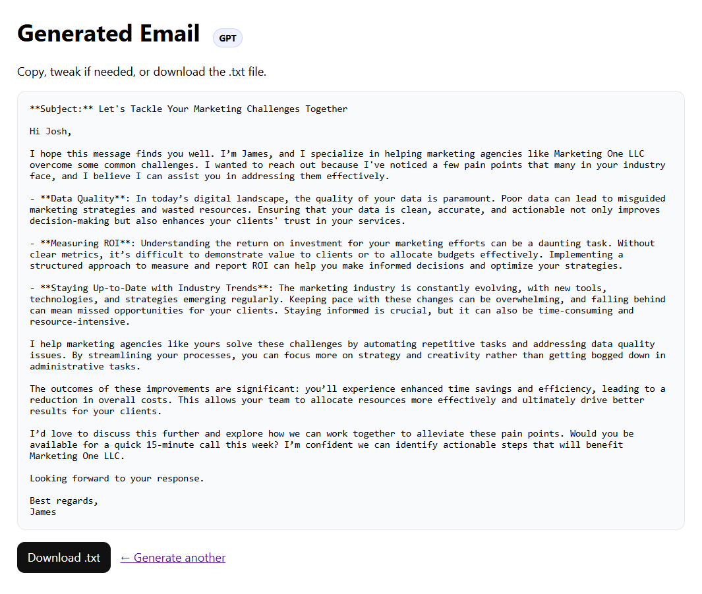

# DealCloser AI 🚀

**DealCloser AI** is a Flask-based web app that generates crisp, tailored outreach emails using GPT models.

👉 **[Live Demo on Render](https://dealcloser-ai.onrender.com)**

---

## ✨ Features
- Generate professional outreach emails with GPT (`gpt-4o-mini`)
- Option to use Jinja2 templates for static emails
- Export generated emails as `.txt` files
- Simple web UI with form input

---

## 📸 Screenshots

### Input Form


### Generated Email


*(replace with real screenshots once you capture them)*

---

## 🛠 Tech Stack
- **Python 3**
- **Flask** (backend)
- **Jinja2** (templating)
- **OpenAI API** (AI-generated emails)
- **Render** (deployment)

---

## 🚀 Run locally
Clone repo & install:
```bash
git clone https://github.com/EngLucaPisani/dealcloser-ai.git
cd dealcloser-ai
python3 -m venv .venv && source .venv/bin/activate
pip install -e .
